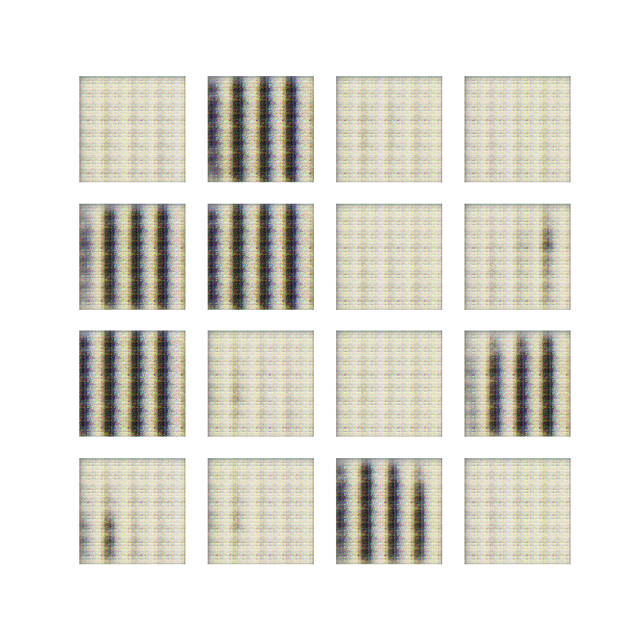
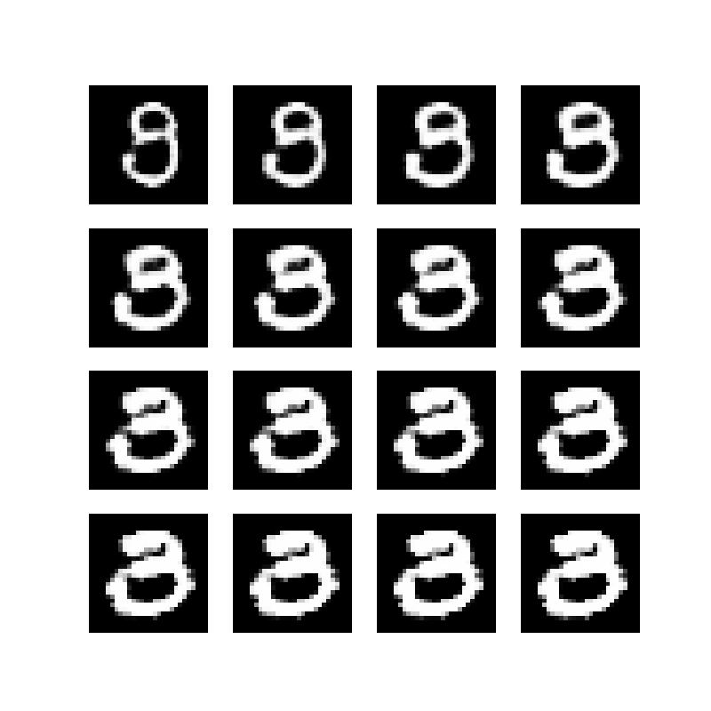

# GANMusicVideo

**An abstract music-video generator that walks the latent space of a painting-trained GAN in time with the music — rendering one frame per audio sample.**

<p align="center"></p>

GANMusicVideo trains a generative adversarial network on paintings, discovers interpretable directions through its latent space, then traces a path through that space driven by a per-frame music signal — decoding each step into a video frame. The output is an abstract music video whose imagery morphs with the audio.

## Features
- **WGAN-GP generator** producing 128×128 RGB images, trained adversarially on WikiArt paintings with a Wasserstein loss and a gradient penalty.
- **Learned inverter (encoder)** that maps real images back to latent codes, so a walk can start from any seed painting and images can be reconstructed — trained jointly to satisfy both `invert(generate(z)) ≈ z` and `generate(invert(x)) ≈ x`.
- **Semantic latent directions** found by fitting a linear SVM per image attribute (brightness, genre, style, era) on the inverted codes and de-correlating the hyperplane normals, InterFaceGAN-style, so edits stay disentangled.
- **Music-reactive latent walk** — a 30-samples-per-second feature signal is scaled onto those directions and added to a seed latent point, producing one latent per frame; the generator renders each.
- **Frames to video** stitched with OpenCV, and pretrained `generator.h5` / `inverter.h5` ship in `models/` so you can render without training first.

## Run it
```bash
# Train the WGAN + inverter on your image set (writes models/generator.h5, models/inverter.h5)
python mnist_wgan_inv.py        # single GPU
python wgan_inv_parallel.py     # multi-GPU (tf.distribute MirroredStrategy)

# Render a music video by walking the latent space (frames -> renders/ -> .avi)
python music_video_creator.py -strength 5
```
Training data is loaded from `data/wikiart-saved/` by `data_loader.py` (WikiArt paintings with style / genre / year metadata); `google_crawler.py` is an included image-crawling utility built on the Google Custom Search API. A short sample render is committed as `video.avi`.

## How it works
The generator, discriminator, and inverter train together: the discriminator scores real versus generated paintings, the generator learns to fool it, and the inverter learns to round-trip both an image and its latent code. Fitting a linear SVM to the inverted codes gives a unit vector per attribute; the music signal scales those vectors and adds them to a starting latent point to produce one latent per frame. Walking that trajectory and decoding each point yields the video — a smooth interpolation through latent space, as below.

<p align="center"></p>

> Heads up: the code targets a TensorFlow 1.x-era stack (`tf.compat.v1`, `tf.contrib`) and won't run cleanly on modern TensorFlow. In the committed demo the music signal is a synthetic sine wave — the pipeline is designed to consume real per-frame audio features.

Tech: Python · TensorFlow / tf.keras · scikit-learn · OpenCV · NumPy · Pillow
